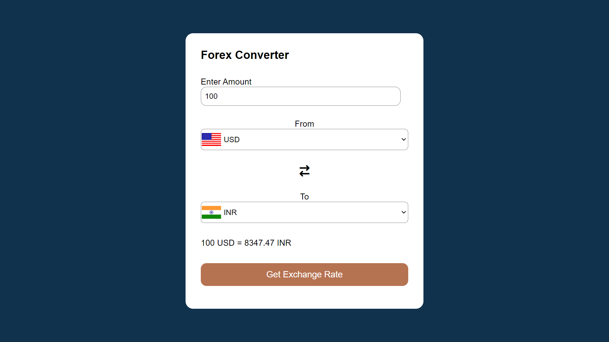

# 🌎💱 Forex Converter

A simple and efficient currency converter built with **HTML**, **CSS**, **JavaScript**, and **APIs**.

## ✨ Features

- 🌐 Convert between multiple currencies
- 🔄 Fetches real-time exchange rates
- 🔄 Swap currencies with a single click
- 📱 Responsive design for all devices

## 🚀 Usage

1. **Clone the repository**:
    ```bash
    git clone https://github.com/ajinkyabh2203/forex-converter.git
    cd forex-converter
    ```

2. **Open `index.html` in your browser**:
    ```bash
    open index.html
    ```

3. **Convert currencies**:
    - Enter the amount
    - Select the currencies
    - Click "_**Get Exchange Rate**_" to see the conversion

## 🛠️ Dependencies

- 🎨 [Font Awesome](https://cdnjs.cloudflare.com/ajax/libs/font-awesome/6.5.2/css/all.min.css) for icons
- 🏳️ [Flags API](https://flagsapi.com) for country flags
- 📈 [Currency API](https://latest.currency-api.pages.dev/v1/currencies) for exchange rates

## 📸 Screenshots



## ✈️ Enjoy your travels!

Use Forex Converter on your next foreign trip to easily manage and convert currencies on the go!

